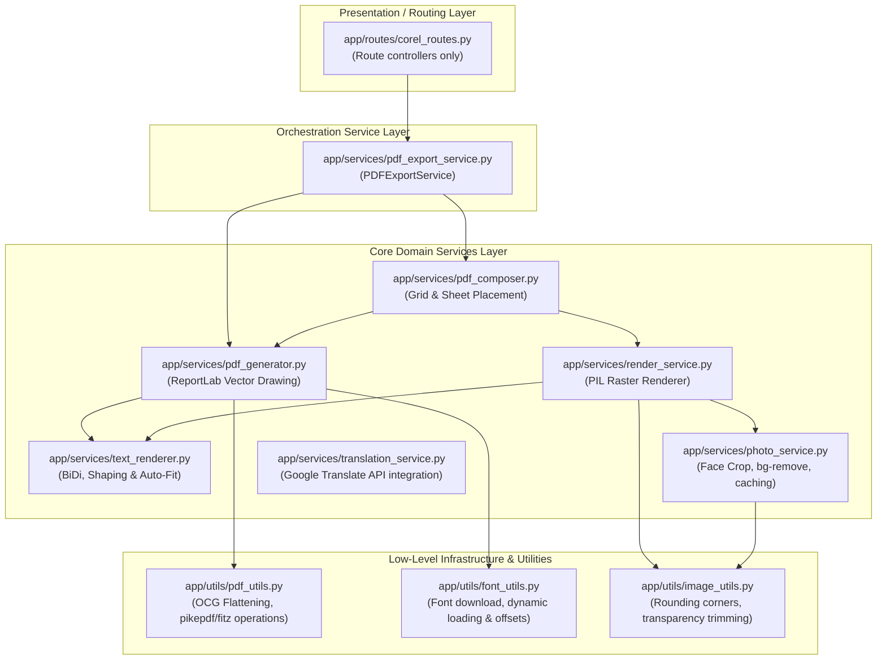

# Structured Refactoring Plan for the ID Project's Core Logic

The core logic of the Multi-School Smart ID Card Generator is currently distributed across massive, monolithic files—primarily `app/routes/corel_routes.py` (5,700+ lines) and `app/services/render_service.py` (1,400+ lines). This layout violates the Single Responsibility Principle (SRP), making maintenance difficult, increases regression risks, and degrades developer onboarding speed.

This document outlines a structural blueprint to decouple routes, page composition, ReportLab PDF generation, PIL raster card rendering, multilingual text shaping, and translation clients into clean, testable service layers.

---

## 🏛️ Refactored Architecture Overview

We propose migrating from a monolithic "Smart Controller" pattern to a clean **Domain-Driven Service Layer** architecture.



---

## 📦 Component Separation Details

### 1. Presentation/Routing Layer (`app/routes/`)
Contains thin route handlers that perform request parameter parsing, authentication/authorization checks, and return the HTTP response.

- **`corel_routes.py`**
  - **Before:** Contains 5,704 lines of layout, drawing, rendering, file fetching, translation, and routes.
  - **After (200 lines):** 
    - `corel_preview(template_id)`: Extracts parameters, delegates to `PDFExportService.preview_pdf`, and returns the PDF preview.
    - `download_compiled_vector_pdf(template_id)`: Authenticates, parses export mode (`editable`/`print`), delegates to `PDFExportService.export_pdf`, and returns the compiled attachment.

---

### 2. Orchestration Services (`app/services/`)
Coordinates different domain services to compile, save, and export final PDF files.

- **[NEW] `pdf_export_service.py` (`PDFExportService`)**
  - Orchestrates fetching templates and students, verifying Design QA status using `premium_service.run_design_qa`, calling the `PDFComposer` to calculate grids, coordinating vector overlays, and returning raw bytes.

---

### 3. Core Domain Services (`app/services/`)
Focused services encapsulating specific business logic.

- **[NEW] `pdf_composer.py` (`PDFComposer`)**
  - Calculates dynamic A4 grid layouts, margins, gaps, column/row matrices, duplex margins, and interleaves front/back pages.
  - Computes exact page bounds and placement rectangles for card printing grids.
  - **Functions to Migrate from `corel_routes.py`:** `_build_template_card_placements`, `_compose_card_pages_to_sheet_pypdf`, `_interleave_pdf_bytes`.

- **[NEW] `pdf_generator.py` (`PDFGenerator`)**
  - Handles ReportLab canvas orchestration, registering fonts, drawing vector backgrounds, applying custom drawing objects from the template designer, and stamping QR/barcode vector elements.
  - **Functions to Migrate from `corel_routes.py`:** `_build_compiled_sheet_via_app_renderer`, `_draw_editable_media_overlays`, `_draw_custom_editor_objects_pdf`, `_draw_text_runs_on_canvas`, `_draw_raster_text_run_on_canvas`.

- **`render_service.py` (PIL Card Renderer - Reduced to 400 lines)**
  - Retains single-card PIL rendering (`render_student_card_side`) and photo cache coordination (`_get_cached_photo`, `_get_cached_final_card`).
  - Calls `PhotoService` for cropping/trimming and `TextRenderer` for text placement.

- **[NEW] `text_renderer.py` (`TextRenderer`)**
  - Encapsulates bidirectional text algorithms (BiDi), Arabic/Urdu shaper overlays, dynamic font size calculations (auto-fit binary search), character spacing, text-wrapping, and vertical gradient text rendering for both ReportLab and PIL.
  - **Functions to Migrate from `render_service.py`:** `draw_text_gradient`, `draw_text_with_spacing_pil`, `measure_text_width_with_spacing_local`, `fit_wrapped_text_pil`, `wrap_text_by_width_pil`, `_ellipsize_to_width_pil`.
  - **Functions to Migrate from `corel_routes.py`:** `_safe_bidi_get_display`, `_clean_bidi_controls`, `process_text_for_vector`, `_contains_arabic_script`.

- **`photo_service.py` (AI Image Pipelines)**
  - Coordinates face detection, automated cropping, background removal (Rembg/ONNX), and transparent margin trimming.
  - **Functions to Migrate from `utils.py`:** `round_photo`, `trim_transparent_edges`, `get_cloudinary_face_crop_url`.

- **[NEW] `translation_service.py` (`TranslationService`)**
  - Manages target language normalization, text translation skip indicators, translation source language auto-detection, and queries the translation backend cache.
  - **Functions to Migrate from `corel_routes.py`:** `_detect_translation_source_language`, `_should_skip_translation`, `_google_translate_text`, `_translate_value_for_export`.

---

### 4. Utilities & Helpers (`app/utils/` / `utils.py` split)
Low-level operations without business context.

- **[NEW] `pdf_utils.py`**
  - Handles byte-level optional-content catalog rebuilding, Pikepdf transformations, marked-content dictionary stripping, and PyMuPDF PDF template checks.
  - **Functions to Migrate from `corel_routes.py`:** `_corel_safe_pdf_bytes`, `_strip_marked_content_operators`, `_strip_page_level_pdf_keys`, `_flatten_optional_content_pdf_bytes`, `_aggressive_corel_flatten`, `_make_corel_friendly`, `_template_pdf_has_corel_hostile_features`.

- **[NEW] `font_utils.py`**
  - Resolves font file integrity, handles dynamic font registry, and fetches fallback Google fonts in the background.
  - **Functions to Migrate from `utils.py`:** `load_font_dynamic`, `download_font_if_missing`, `is_valid_font_file`.

---

## 🔄 Proposed Code Refactoring: Before vs. After

### Endpoint Handler in `app/routes/corel_routes.py`

#### 🔴 BEFORE (Monolithic)
```python
@corel_bp.route("/download_compiled_vector_pdf/<int:template_id>")
@admin_required
def download_compiled_vector_pdf(template_id):
    try:
        mode = parse_pdf_export_mode(request.args.get("mode"))
        template = db.session.get(Template, template_id)
        # 150 lines of database validation and dimension checks...
        
        # 200 lines of canvas generation setup...
        front_bytes = _build_compiled_sheet_via_app_renderer(
            template=template,
            students=students,
            side="front",
            # ...
        )
        # 500 lines of ReportLab inline canvas drawing...
        # ...
        return send_file(buffer, as_attachment=True, download_name=filename)
    except Exception as e:
        logger.error(e)
        return "Internal Error", 500
```

#### 🟢 AFTER (Decoupled Service Call)
```python
from flask import request, send_file
from app.routes import corel_bp
from app.services.pdf_export_service import PDFExportService
from app.utils.security_utils import admin_required

@corel_bp.route("/download_compiled_vector_pdf/<int:template_id>")
@admin_required
def download_compiled_vector_pdf(template_id: int):
    """Clean entrypoint: parses parameters and delegates execution."""
    mode = request.args.get("mode", "print")
    export_service = PDFExportService()
    
    pdf_bytes, filename = export_service.generate_compiled_pdf(
        template_id=template_id, 
        mode=mode
    )
    
    return send_file(
        pdf_bytes,
        as_attachment=True,
        download_name=filename,
        mimetype='application/pdf'
    )
```

---

## 📈 Refactoring Roadmap & Priority

To minimize downtime and prevent regression in card generation, the refactoring should follow a multi-stage release cycle:

| Phase | Target Area | Estimated Effort | Risk | Verification Method |
| :--- | :--- | :--- | :--- | :--- |
| **Phase 1** | Extract Low-level PDF utils into `pdf_utils.py` | Low | Medium | Run `verify_transparency.py` & `verify_layered_pdf.py` |
| **Phase 2** | Extract RTL, BiDi, and translation logic | Medium | High | Run Urdu/Arabic rendering test suite |
| **Phase 3** | Extract ReportLab vector overlays & placements | High | High | Run PyMuPDF canvas matching comparison |
| **Phase 4** | Extract Grid & A4 Composition Calculations | Medium | Medium | Run page count and coordinate offset assert checks |
| **Phase 5** | Clean up `corel_routes.py` and modularize route handlers | Low | Low | Run integration test client suite |

---

## 🧪 Verification Plan

Every refactoring phase must be verified using the following automated tools to guarantee binary identical outputs:

### 1. Visual Structural Regression Tests
We can verify vector layout coordinates remain identical by comparing the output PDF size and internal streams:
```python
# run verify_vector_pdf.py and verify_layered_pdf.py
python verify_vector_pdf.py
python verify_layered_pdf.py
```

### 2. Multi-Language Shaper Verification
Compare the output image hashes for Arabic and Urdu rendering to check font resolution and baseline alignments:
```python
python -m pytest tests/test_language_rendering.py
```
